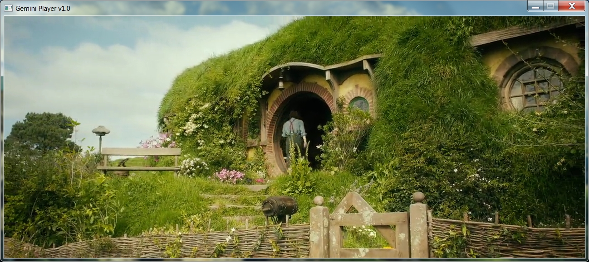

# Gemini Media Player
## Media Player based on FFmpeg & SDL.
>此工程默认设置x64平台配置
>version: ffmpeg-3.2.4-win64
>Version: SDL2-devel-2.0.5-VC

## VS2017设置
- 属性 - C/C++ - 常规 - 附加包含目录：include;%(AdditionalIncludeDirectories)
- 属性 - 链接器 - 常规 - 附加库目录： lib/ffmpeg; lib/sdl;%(AdditionalLibraryDirectories)
- 属性 - 链接器 - 输入 - 附加依赖项： SDL2.lib;SDL2main.lib;avcodec.lib;avformat.lib;avutil.lib;swscale.lib;swresample.lib;postproc.lib;avfilter.lib;avdevice.lib;%(AdditionalDependencies)

## Screenshots

